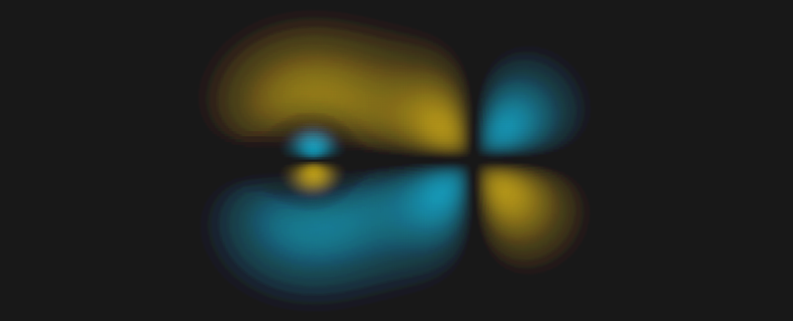
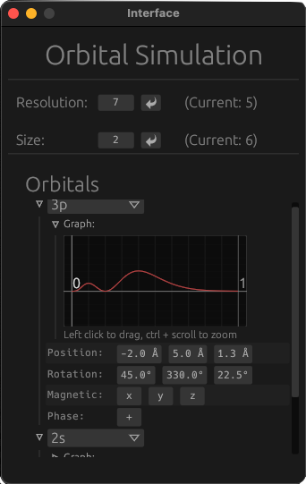

# Orbital Simulation
A tool that simulates the shape and characteristics of atomic orbitals.
 
 

It features an integrated GUI from which you can change the simulation:
 
 

## License
OrbitalSim is free and open-source. All of the code is licensed under:

* MIT License ([LICENSE-MIT](docs/LICENSE-MIT) or [http://opensource.org/licenses/MIT](http://opensource.org/licenses/MIT))

Unless you explicitly state otherwise, any contribution intentionally submitted
for inclusion in the work by you licensed as above, without any
additional terms or conditions.
